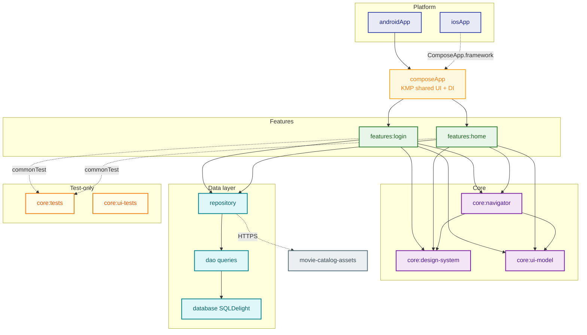

# Movie Catalog

**Kotlin Multiplatform** + **Compose Multiplatform** app for **Android** and **iOS**: movie catalog with sign-in, remote list, and per-item detail.

**Package / applicationId:** `com.moviecatalog` · **iOS bundle:** `com.moviecatalog.app` (adjust in `iosApp/Configuration/Config.xcconfig` if needed)

---

## Main flows

### App entry

1. **Splash** — Branded opening screen with a progress bar; when it finishes, the navigation stack is **replaced** with the **login** flow.
2. **Login** — User enters credentials. On success, the app **replaces** the current flow with the **catalog (home)**. **Create account** **pushes** the registration screen.

### Sign up

3. **Sign up** — Username, password, and confirmation with validation rules and feedback. After a successful registration, the app **pops** back to the previous screen (**login**) on the stack.

### Catalog

4. **Home** — Grid of movies loaded from hosted JSON; tapping an item opens that movie’s **detail** screen.
5. **Detail** — Expanded content (hero image, metadata); the top bar supports **back** to the list.

Navigation uses **destinations** (`Login`, `Sign up`, `Home`) and stackable **steps** (e.g. detail by `movieId`), with **Voyager** under the `core:navigator` module.

---

## Screens (overview)

| Screen | Role |
|--------|------|
| **Splash** | Branding + progress before login. |
| **Login** | Account access; shortcut to sign up. |
| **Sign up** | Account creation with password validation. |
| **Home** | Grid list with posters and subtitles. |
| **Detail** | Scrollable view with hero image and descriptive fields. |

---

## Remote data & images ([movie-catalog-assets](https://github.com/souzabrunoj/movie-catalog-assets))

Static JSON and media for the catalog are maintained in the companion repo **[souzabrunoj/movie-catalog-assets](https://github.com/souzabrunoj/movie-catalog-assets)** (folders such as `cinegraph/movies/` and `splash/`). The app loads them over **GitHub Pages**, not the raw GitHub API:

**Base URL:** `https://souzabrunoj.github.io/movie-catalog-assets/`

- **Movie list JSON** — fetched by the home feature (e.g. `…/cinegraph/movies/1/movies-list.json`). URLs inside the payload point at poster/hero images also served from that same site.
- **Splash & branding** — e.g. splash logo under `…/splash/`.

To change content or add assets, update that repository and keep paths in sync with any hard-coded URLs in this project (or centralize the base URL in one place if you refactor).

---

## `core` modules

Shared layer used by features and `composeApp`, without going into implementation detail:

- **`core:navigator`** — Destination registry, `Step`, navigation flow wiring, and screen-related state helpers.
- **`core:design-system`** — Theme and reusable Compose building blocks (buttons, inputs, typography, etc.).
- **`core:ui-model`** — Base for screen **UiModels** (data + loading/content/error mode).
- **`core:data-base`** — Local persistence where the app domain needs it.
- **`core:tests`** — Shared **unit / commonTest** helpers (e.g. coroutine test dispatchers, `runViewModelTest`). **`features:login`** and **`features:home`** add **`implementation(projects.core.tests)`** under **`commonTest`**—so **feature test sources depend on `core:tests`**; `core:tests` does not depend on feature modules.
- **`core:ui-tests`** — Placeholder module for **shared UI or instrumentation test** utilities on Android (and future KMP UI tests). Included in `settings.gradle.kts`; wire it from test source sets when you add shared UI-test code.

**Features** (`features:login`, `features:home`) hold screens, DI, and use cases for their domain. **`composeApp`** wires everything and defines startup (e.g. splash); **`androidApp`** is the Android entry that embeds the app.

### Architecture (module graph)

Gradle modules and their main dependency direction (simplified). The **`build-logic`** included build applies shared plugins (Detekt, ktlint, KMP/Android/Compose setup) across app and library modules; it is not an `implementation` dependency of the graph below.



**Notes:**

#### 📐 Architecture notes

#### 🔗 Dependency flow

- **Solid arrows** — `implementation` dependencies on **main** source sets.
- **Dotted arrows** —
  - **`commonTest`** dependencies (**features → `core:tests`**), or
  - **Remote** communication (HTTP to APIs / hosted assets).

#### 🧩 Core layer

**`core:ui-model`** defines shared UI contracts:

- `UiModel`
- `UiMode`
- `UiModelState`
- Screen-state abstractions built on those types

Feature ViewModels extend **`UiModel`**.

Modules that depend on **`core:ui-model`**:

- `composeApp`
- `features:login`
- `features:home`
- `core:navigator`

#### 🧭 Navigation & UI

**`core:navigator`** depends on:

- `core:ui-model`
- `core:design-system` (Compose + Voyager)

#### 🧪 Testing

Feature modules depend on **`core:tests`** via **`commonTest`**.

**`core:ui-tests`** is currently isolated (**no direct Gradle dependencies** yet).

#### 📦 Platform

**`androidApp`** also declares direct dependencies on:

- `core:navigator`
- `features:login`
- `features:home`

These are **omitted from the diagram** for readability.

#### 💾 Data layer

The **Data layer** is **conceptual** (not a single Gradle module) and includes:

- Repository
- DAO / queries
- SQLDelight database

---

## Requirements and build

- **JDK** 17+
- **Android Studio** / IntelliJ with KMP support
- **Xcode** (iOS)

Shared Gradle conventions live in **`build-logic/`** (Detekt, ktlint). For new modules, add the same platform plugins as the rest of the project.

**Automation:** see **[Make commands](#make-commands)** (`make help` lists every target).

**CI (GitHub Actions):** `.github/workflows/development.yaml` runs Detekt, ktlint, and **`./gradlew :composeApp:jvmTest`**; iOS build in `.github/workflows/build-ios.yml`.

**iOS:** open `iosApp/iosApp.xcodeproj` in Xcode. If the product or IDE state looks wrong, *Clean Build Folder* (⇧⌘K) or clear *Derived Data*.

---

## Make commands

Targets are defined in the repo **`Makefile`**. Run **`make help`** for the same list in the terminal.

| Target | Description |
|--------|-------------|
| `help` | List all targets (default goal). |
| `assembleDebug` | Build debug APK (`:androidApp:assembleDebug`). |
| `installDebug` | Install debug APK on a connected device or emulator. |
| `openDebug` | Launch the app via adb (`MainActivity`). |
| `runAppDebug` | `assembleDebug` + `installDebug` + open launcher. |
| `clearCache` | Clear app data for `com.moviecatalog` via adb. |
| `embedIosFramework` | Build/embed the Compose framework for Xcode (`embedAndSignAppleFrameworkForXcode`). |
| `detekt` | Run Detekt on all modules that apply the plugin. |
| `ktlintFormat` | Auto-fix Kotlin style (ktlint). |
| `ktlintCheck` | Verify Kotlin style (CI-friendly). |
| `lint` | `ktlintFormat` then `ktlintCheck`. |
| `check` | `detekt`, `ktlintCheck`, `allTests`, and `assembleDebug`. |
| `ci` | Same as `check`. |
| `test` | All KMP unit tests Gradle schedules (`allTests`). |
| `build` | Same as `check`. |
| `clean` | `./gradlew clean`. |
| `stop` | Stop Gradle daemons. |
| `status` | Gradle daemon status. |

---

## Command-line (Gradle)

Catalog JSON and images are served from the companion repo **[movie-catalog-assets](https://github.com/souzabrunoj/movie-catalog-assets)** via GitHub Pages (`https://souzabrunoj.github.io/movie-catalog-assets/`); see **Remote data & images** above.

```bash
./gradlew :androidApp:assembleDebug   # debug APK
./gradlew detekt                      # static analysis
./gradlew :composeApp:jvmTest         # JVM unit tests (same as CI “unit-tests” job)
./gradlew allTests                    # all KMP unit tests the project defines (broader / slower)
```

For wrapped equivalents (and Android install/run), use **[Make commands](#make-commands)**.
